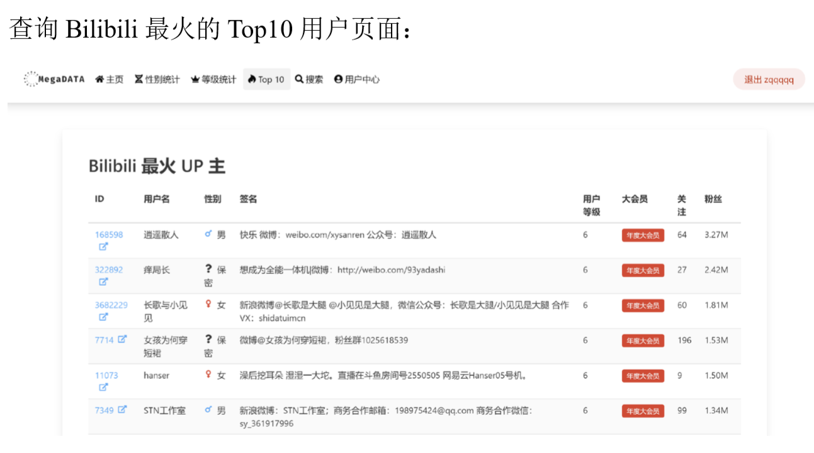

## 快速开始

本次project前端部分使用 React 技术栈构建，用到的第三方仓库包括 React Router DOM（页面路由及导航）、Bulma（基础样式）、React Hook Form（表单验证）、Axios（HTTP API 请求）、Recharts（图表渲染）等。

后端部分使用Django构建，通过设计restful风格的api来与前端交互

地址:

#### 前端环境配置

您需要安装对应平台的 [Node.js](https://nodejs.org/) 和 [Yarn](https://yarnpkg.com/zh-Hans/)，它们的官方网站有详尽的安装说明。

> 如果 Yarn 频繁出现网络错误，请考虑使用 [mirror-config-china](https://github.com/gucong3000/mirror-config-china) 来改善网络状况。

然后，在 `frontend` 目录中使用 Yarn 来安装所有依赖包：

``` shell
cd /path/to/project/frontend
yarn
```

#### 前端启动开发服务器

然后使用 Yarn 来启动开发服务器：

``` shell
yarn start
```

#### 前端生产环境编译

然后使用 Yarn 来进行生产环境编译：

``` shell
yarn build
```

#### 后端环境配置

建议在使用虚拟环境创建project内项目需要的环境

```
virtualenv <your environment name here>
```

然后，在`backend`目录中使用pip来安装所有依赖包：

```
pip install -r requirements.txt
```

#### 后端启动服务器

然后启动后端服务器

```
python manage.py runserver
```

## 项目架构

主要思路在于

- 前端使用Axios封装的http请求来发送POST和GET。
- 后端对http请求进行解析并根据请求内容返回相应的json数据(前后端分离)。
- 前端在拿到json数据后对前端的图表或页面组件部分进行渲染。
- 通过token实现用户鉴权、相应用户信息获取和修改。

#### 细节实现

- **token**通过django_restframework中的jwt(json web token)进行实现。当用户登录后会根据用户信息和过期时间的设定生成相应的token并且返回到前端。前端将token保存下来并且在之后的每一次请求的发送中，会将存在本地(window.localStorage)的token预先绑定到header中，后端通过解码header中的token实现用户鉴权(如得到用户信息等都是通过获取token中的用户信息实现搜索并回传)。

```typescript
/**
 * 在请求头添加 JWT
 */
export const setApiTokenHeader = (token?: string): void => {
  const headers = token ? { token } : {};
  client.defaults.headers = {
    ...client.defaults.headers,
    ...headers,
  };
};
```

```typescript
/**
 * 前后端交互/axios
 * 此例为获取token
 */
...
static async login(username: string, password: string): Promise<AxiosResponse<TokenResp>> {
    return client.post('login/', { username, password });
  }
...
const { data: { token } } = await api(values.username, values.password);
dispatchUser({
		type: UserActionTypes.CommitToken,
		payload: token,
      });
...
```

```typescript
/**
 * 设置token
 */
const userReducer: Reducer<UserStoreState, UserAction> = (prevState, action) => {
  const { type, payload } = action;
  switch (type) {
    case UserActionTypes.CommitToken:
      window.localStorage.setItem('token', payload);
      setApiTokenHeader(payload);
      return {
        ...prevState,
        user: undefined,
        token: payload,
      };
    case UserActionTypes.CommitUser:
      return {
        ...prevState,
        user: payload,
      };
    case UserActionTypes.SetLoading:
      return {
        ...prevState,
        isLoading: payload,
      };
    case UserActionTypes.SignOut:
      window.localStorage.removeItem('token');
      setApiTokenHeader();
      return {
        ...prevState,
        user: undefined,
        token: undefined,
      };
    default:
      return prevState;
  }
};
/**
 * 用户 HOOKs
 */
export const useUser = (): [UserStoreState, Dispatch<UserAction>] => {
  const [user, dispatch] = useReducer(userReducer, defaultUserStoreState);

  useEffect(() => {
    // 从 localStorage 读取 JWT
    const savedToken = window.localStorage.getItem('token');
    if (!savedToken) return;
    setApiTokenHeader(savedToken);

    // 获取用户数据
    dispatch({
      type: UserActionTypes.SetLoading,
      payload: true,
    });
    AuthApi.getUserInfo()
      .then(({ data }) => dispatch({
        type: UserActionTypes.CommitUser,
        payload: data,
      }))
      // 失败了的话清除 token
      .catch(() => dispatch({
        type: UserActionTypes.SignOut,
      }))
      .finally(() => dispatch({
        type: UserActionTypes.SetLoading,
        payload: false,
      }));
  }, []);

  return [user, dispatch];
};
```

- Django只负责回传json数据，不再需要template部分。为了良好的使用体验，在用户搜索部分我们设计了一个简单的分页。后端在数据库查询之后会回传搜索结果的总页数(每页十个用户，最后一页少于十个)，当前页面的用户数，当前搜索页用户的json数据给前端。之后前端进行相应的渲染。
- 图表通过Recharts渲染得到。
- Django后端restful api如下

```python
urlpatterns = [
    path('admin/', admin.site.urls),
    path('api/alluser/', user_views.getlist),
    path('api/login/', login_views.getlist),
    ##登录api
    path('api/regist/', regist_views.getlist),
    ##注册api
    path('api/getsexnum/',bili_views.getnumberofsex),
    ##性别数量获取api
    path('api/getlevelnum/',bili_views.getnumberoflevels),
    ##等级数量获取api
    path('api/getmostfans/',bili_views.mostfans),
    ##获取最多粉丝量up主
    path('api/getuserinfo/',user_views.getuserinfo),
    ##获取用户信息api
    path('api/setuserinfo/',user_views.setuserinfo),
    ##设置用户信息api
    path('api/search/',bili_views.search),
    ##搜索api
    # path('login/',login_views.UserAPI.post),
]

```

项目截图


